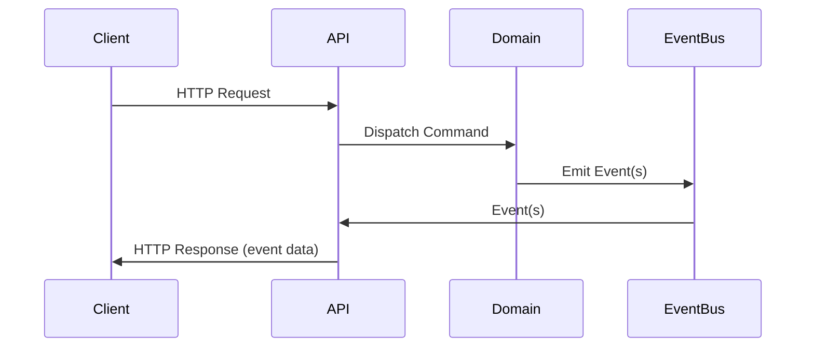

# Event-Driven REST API Design

## Overview

This document describes the event-driven REST API architecture for the CV TritiumD backend, following a modular, command/event-based approach. The API is organized into three main routers: upload, form, and output. Each endpoint receives a command, dispatches it to the domain layer, and returns the resulting event(s).

---

## 1. `upload.py`

**Endpoints:**
- `POST /upload/` — Upload markdown file (maps to `UploadMarkdownFileCommand`)
- `POST /upload/validate/` — Validate uploaded file (`ValidateFileCommand`)
- `DELETE /upload/{file_uid}/delete/` — Delete uploaded file (`DeleteFileCommand`)

**Request/Response Models:**  
Use command dataclasses for requests, event dataclasses for responses (e.g., `MarkdownFileUploadedEvent`, `FileStorageSucceededEvent`, `FileValidationFailedEvent`).

**Flow:**  
API receives request → constructs command → dispatches to domain → returns resulting event(s) as response.

---

## 2. `form.py`

**Endpoints:**
- `POST /form/` — Submit form data (`ProcessFormDataCommand`)
- `POST /form/validate/` — Validate form data (`ValidateFormDataCommand`)
- `POST /form/{form_uid}/save/` — Save validated form data (`SaveFormDataCommand`)

**Request/Response Models:**  
Use command dataclasses for requests, event dataclasses for responses (e.g., `FormDataReceivedEvent`, `FormValidationCompletedEvent`, `FormValidationFailedEvent`).

**Flow:**  
API receives request → constructs command → dispatches to domain → returns resulting event(s) as response.

---

## 3. `output.py`

**Endpoints:**
- `GET /output/{file_uid}` — Retrieve/download output file (`RetrieveFileCommand`)
- `GET /output/{file_uid}/content` — Retrieve file content (`RetrieveFileContentCommand`)
- `GET /output/{file_uid}/stream` — Stream file content (`StreamFileCommand`)
- `GET /output/records/` — Query output file records (`QueryFileRecordsCommand`)

**Request/Response Models:**  
Use command dataclasses for requests, event dataclasses for responses (e.g., `OutputFileDeliveredEvent`, `OutputFileNotFoundEvent`).

**Flow:**  
API receives request → constructs command → dispatches to domain → returns resulting event(s) as response.

---

## Rationale

- **Modular routers** for upload, form, and output operations.
- **Event-driven**: All endpoints dispatch commands and return domain events, decoupling API from business logic.
- **FastAPI best practices**: RESTful paths, strong typing, clear error handling, support for streaming/large files.
- **Extensible**: New commands/events can be added with minimal changes to API surface.

---

## High-Level Flow (Mermaid)

---

**This design is the foundation for the event-driven REST API implementation in the CV TritiumD backend.**